# Swagger 2 (Using Springfox) And JUnit Test-cases (Mockito) Spring boot application 

Dockerized Spring Boot application with Swagger 2 implementation and JUnit test-cases using Mockito.

## Getting Started

These instructions will get you a copy of the project up and running on your local machine for development purposes. See running for notes on how to run the project on a system.

### Prerequisites

1. Clone the project to your local environment:
    ```
    git clone https://github.com/ankitrajput0096/Swagger_And_JUnit_SpringBoot_Dockerized
    ```

2. You need maven installed on your environment:

    #### Mac (homebrew):
    
    ```
    brew install maven
    ```
    #### Ubuntu:
    ```
    sudo apt-get install maven
    ```

3. You need Docker to be installed:

    #### Windows:
    https://download.docker.com/win/stable/Docker%20for%20Windows%20Installer.exe
    
    #### Mac:
    https://download.docker.com/mac/stable/Docker.dmg
    
    #### Ubuntu:
    https://docs.docker.com/install/linux/docker-ce/ubuntu/

### Installing

Once you have maven and docker installed on your environment, install the project dependencies via:

```
mvn install
```

Build docker Image:

```
docker-compose build
```

Start docker:

```
docker-compose up
```
# Testing of Unit Test Cases using Mockito 
1. Open terminal or command prompt with directory location as `spring_boot_jpa` folder.
2. Write this command in terminal or command prompt : `mvn test`
3. All test-cases will be run automatically of this spring boot application.
4. Enjoy !!

## Running

Start docker:
```
docker-compose up
```

Run the application from the `Application.java` main method directly,
or from a command line:
```
mvn spring-boot:run
```

Keep docker running in a separate terminal tab, create another tab to run the application.

Your server should be now running on http://localhost:8090

# Get an access to all exposed API's using SWAGGER 2

1. Open any web browser.
2. Write this URL in the web browser : http://localhost:8090/swagger-ui.html
3. Enjoy !!

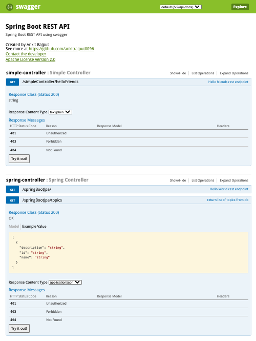
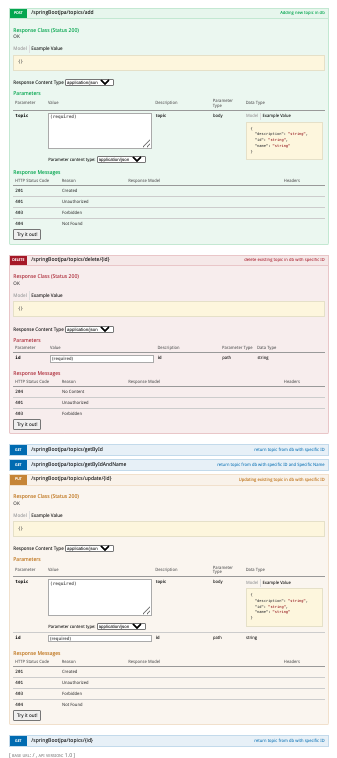


## Get an access to all exposed API's with Postman

1. Install Postman (https://www.getpostman.com)
2. Import Postman collection from the `Swagger_SpringBoot_Dockerized.postman_collection.json` file
3. Enjoy !!


## JMeter Load Testing

### About JMeter Load Testing
Apache JMeter is an open-source tool used for performance testing, load testing, and stress testing of applications, particularly web services and APIs. In this project, JMeter is employed to simulate concurrent users interacting with the Spring Boot application's RESTful APIs (e.g., for managing "topics" via CRUD operations). The load tests measure key metrics like response times, throughput, and error rates under simulated traffic. Each test is configured with Thread Groups to mimic real-world usage, using CSV data for dynamic payloads and assertions to validate responses. Tests are run on the dockerized app at `localhost:8090`.

### Advantages of JMeter Load Testing
- **Open-Source and Free**: No licensing costs, with a large community for support and plugins.
- **Platform-Independent**: Runs on Windows, macOS, Linux, and supports GUI/CLI modes.
- **Extensible**: Easily integrates with CSV data, assertions, listeners (e.g., Summary Report), and can be scripted in BeanShell or Groovy.
- **Versatile**: Tests various protocols (HTTP, JDBC, etc.) and simulates realistic user behaviors with ramps and loops.
- **Detailed Reporting**: Provides metrics like average response time, throughput, and errors to identify bottlenecks.
- **Reusable Scripts**: .jmx files can be version-controlled and automated in CI/CD pipelines.

### Installing JMeter on macOS and Starting It
To install JMeter on a MacBook using Homebrew (recommended for simplicity):

1. Install Homebrew (if not already): Open Terminal and run `/bin/bash -c "$(curl -fsSL https://raw.githubusercontent.com/Homebrew/install/HEAD/install.sh)"`.
2. Update Homebrew: `brew update`.
3. Install JMeter: `brew install jmeter`.
4. Verify: `jmeter -v` (should show the version, e.g., 5.6+ as of December 2025).
5. Start JMeter GUI: Run `jmeter` in Terminal. This opens the interface for creating/editing .jmx files.

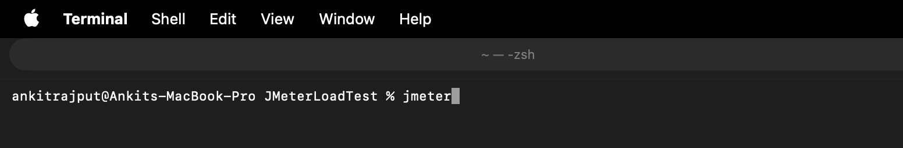

6. For CLI runs: Use `jmeter -n -t your_test.jmx -l results.jtl` (non-GUI mode for heavy loads).

If Homebrew isn't preferred, download the binary from [jmeter.apache.org](https://jmeter.apache.org/download_jmeter.cgi), extract, and add `/bin` to your PATH.

### Tabular Information for Load Tests (POST, GET, PUT, DELETE APIs)
The following table summarizes the load test configurations for key APIs, based on simulated users and iterations. These are isolated tests; adjust for your environment.

| API Endpoint | Method | Concurrent Users (Threads) | Ramp-up Time (seconds) | Loops | Total Requests | Purpose |
|--------------|--------|----------------------------|-------------------------|-------|----------------|---------|
| /springBootJpa/topics/add | POST | 50 | 15 | 10 | 500 | Test creating new topics; uses CSV for unique data. |
| /springBootJpa/topics/{id} (e.g., /java) | GET | 75 | 15 | 30 | 2,250 | Test fetching specific topic by ID; parameterize ID. |
| /springBootJpa/topics/update/{id} (e.g., /java) | PUT | 40 | 10 | 10 | 400 | Test updating topics; uses CSV for updated values. |
| /springBootJpa/topics/delete/{id} (e.g., /java) | DELETE | 30 | 10 | 5 | 150 | Test deleting topics; destructive, fewer loops. |

### Steps to Write Load Tests for POST, GET, PUT, DELETE APIs
Follow these general steps in JMeter GUI to create tests (one Thread Group per API, or multiple in one .jmx). Assume app is running.

1. **Setup Test Plan**:
   - Launch JMeter > New Test Plan.
   - Add Thread Group (Right-click Test Plan > Add > Threads > Thread Group).
   - Configure: Threads (users), Ramp-up, Loops (per table above).

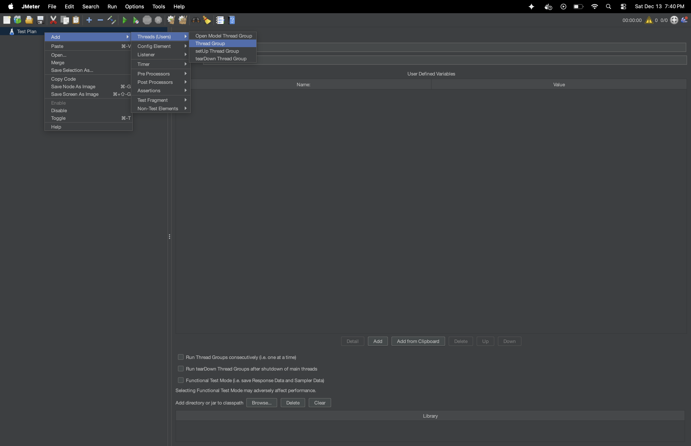
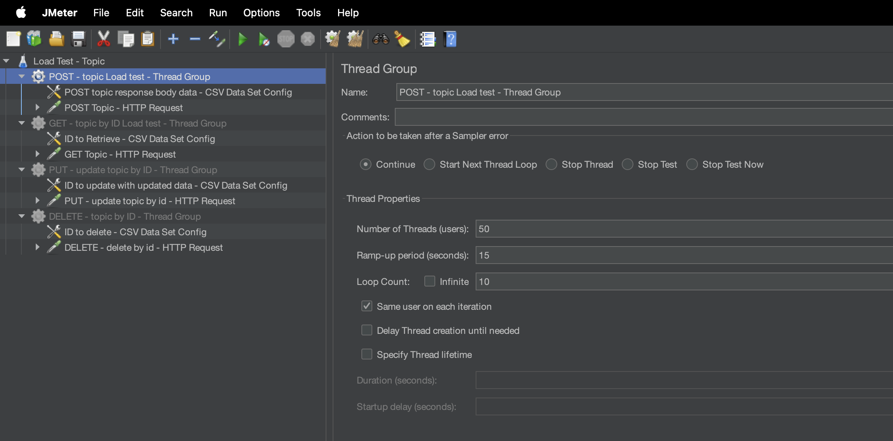

2. **Add CSV Data Set (for POST/PUT/DELETE/Parameterized GET)**:
   - Right-click Thread Group > Add > Config Element > CSV Data Set Config.
   - Filename: Path to `topics_data.csv` or `updates_data.csv` (columns: id,name,description).
   - Variables: `id,name,description`.
   - Recycle: True.

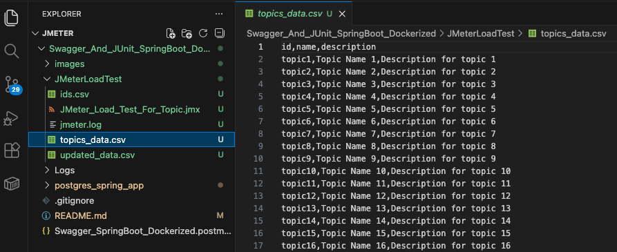
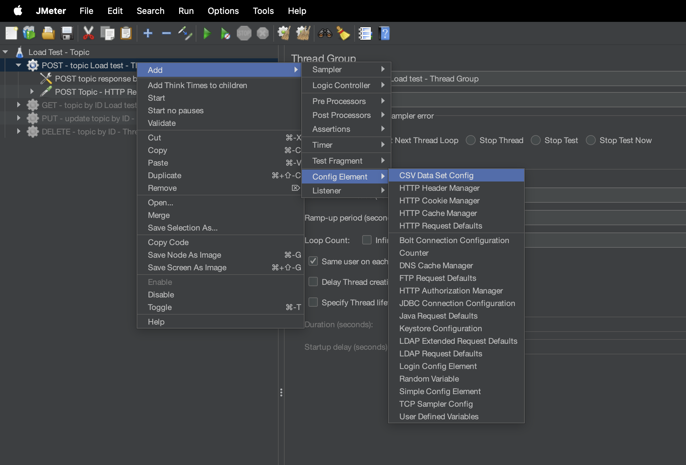
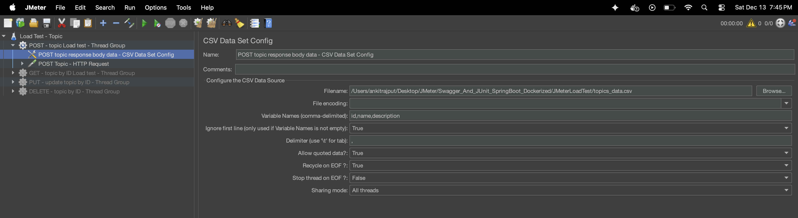

3. **Add HTTP Request Sampler**:
   - Right-click Thread Group > Add > Sampler > HTTP Request.
   - Server: localhost; Port: 8090; Method: As per API (POST/GET/PUT/DELETE).
   - Path: e.g., `/springBootJpa/topics/add` for POST; Use `${id}` for dynamic paths in GET/PUT/DELETE.
   - For POST/PUT: Body Data as JSON with variables, e.g., `{"id":"${id}","name":"${name}","description":"${description}"}`.

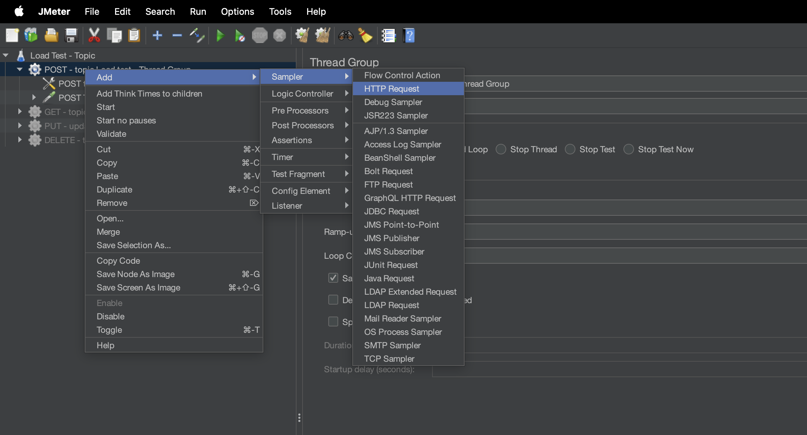
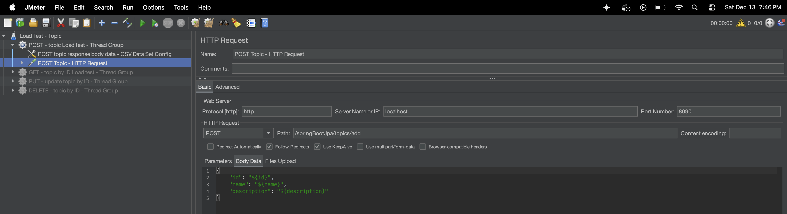
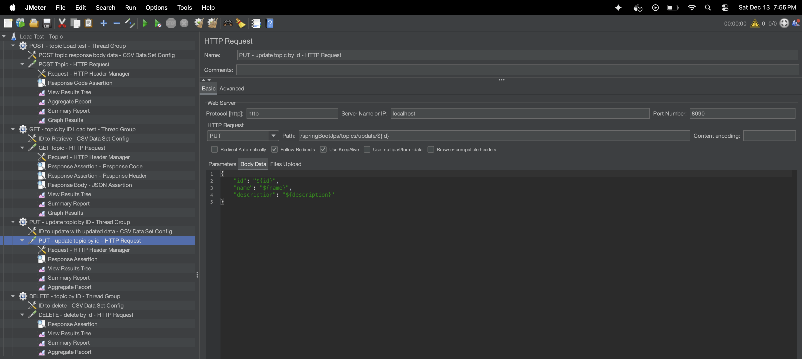

4. **Add HTTP Header Manager (for POST/PUT)**:
   - Right-click HTTP Request > Add > Config Element > HTTP Header Manager.
   - Add: `Content-Type: application/json`.

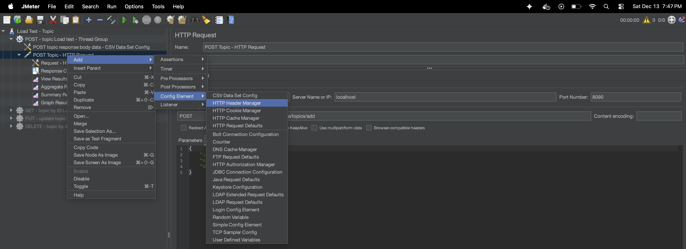
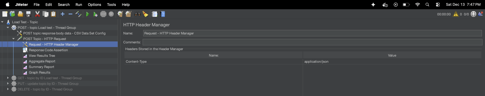


5. **Add Assertions**:
   - Right-click HTTP Request > Add > Assertions > Response Assertion.
   - For status: Response Code equals 200/201/204.
   - For body: Text Response contains `${id}` or expected string.

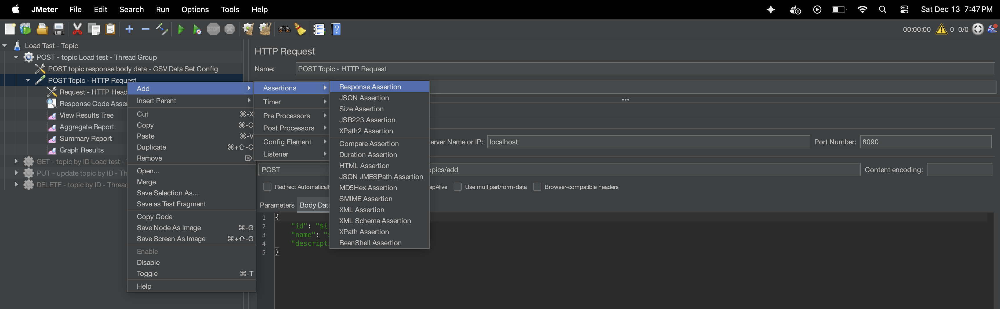
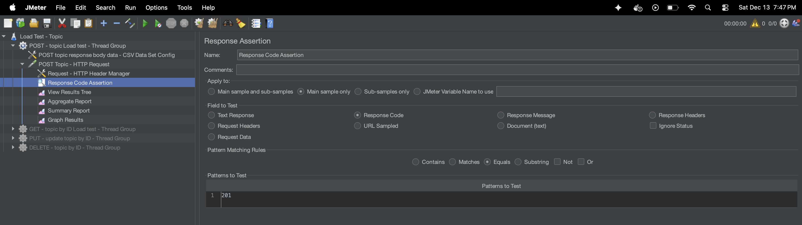
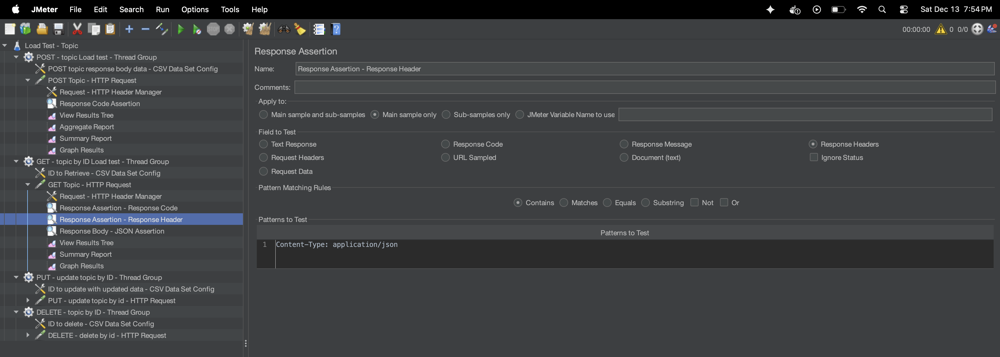
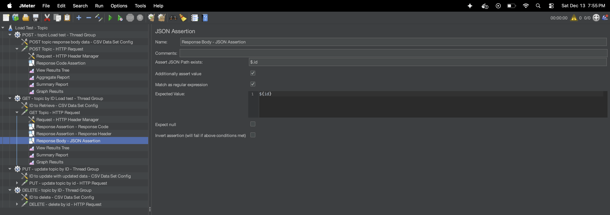


6. **Add Listeners**:
   - Add View Results Tree, Summary Report, Aggregate Report.

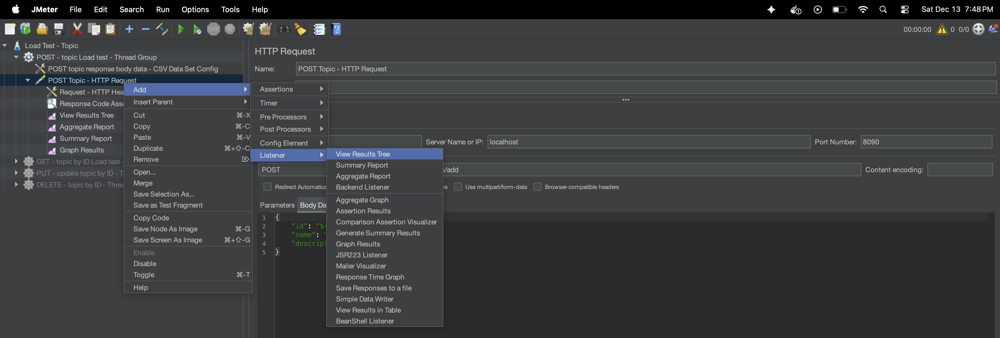


7. **Save and Run**:
   - Save as .jmx.
   - Test with 1 thread/loop first, then full load.

For dependencies (e.g., create before update/delete), add Setup Thread Group with POST logic.

### Importance of Threads, Ramp-up, and Loops
- **Threads (Concurrent Users)**: Represents simultaneous users hitting the API. Higher threads simulate heavier load to test concurrency handling (e.g., DB locks). Importance: Reveals scalability issues; e.g., 50 threads for POST checks if the app handles 50 simultaneous creates without errors.
- **Ramp-up Time**: Time (seconds) to gradually start all threads. E.g., 15s for 50 threads starts ~3-4 per second. Importance: Mimics real traffic growth, avoiding artificial spikes that could crash the system prematurely.
- **Loops**: Iterations per thread. E.g., 10 loops mean each user repeats the request 10 times. Importance: Extends test duration for sustained load measurement without more threads; helps calculate total requests (Threads × Loops).

### Analysis of JMeter Summary Report Screenshot
It ran 500 samples (requests) with 0% errors, indicating successful execution. Below, I explain the important columns and their implications:

- **Label**: Name of the sampler (e.g., "POST Topic - HTTP Request"). Groups results by request type.
- **# Samples**: Total requests executed (500 here). Matches Threads × Loops (e.g., 50 × 10).
- **Average**: Mean response time in ms (4 ms). Low value indicates fast API; aim <500ms for good performance.
- **Min/Max**: Shortest (1 ms) and longest (139 ms) response times. Wide gap may signal variability (e.g., occasional DB delays).
- **Std. Dev.**: Standard deviation of response times (6.95 ms). Low value means consistent performance.
- **Error %**: Percentage of failed requests (0.00%). Critical; >0% requires debugging (e.g., assertions or server logs).
- **Throughput**: Requests per second (34.0/sec). Measures handling capacity; higher is better for scalability.
- **Received KB/sec & Sent KB/sec**: Data transfer rates (2.42 KB/sec received, 9.93 KB/sec sent). Useful for bandwidth analysis.
- **Avg. Bytes**: Average response size (73.0 bytes). Small here, typical for simple JSON.

Overall, this test shows excellent performance: quick, consistent, error-free. If errors appear in future runs, check app logs or increase ramp-up. Use Aggregate Report for percentiles (e.g., 90th % response time).

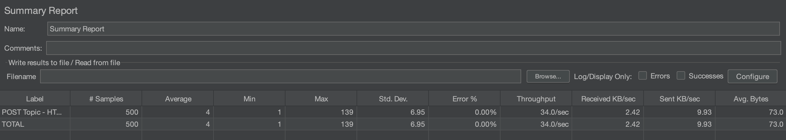

### Analysis of JMeter Aggregate Report Screenshot
This report aggregates performance metrics across 500 samples (requests), showing 0% errors, which indicates a successful and stable test run. The Aggregate Report provides more detailed percentiles than the Summary Report, making it useful for understanding response time distribution (e.g., how the API performs for the majority of users). Below, I explain the important columns and their implications for load testing an API:

- **Label**: The name of the sampler or request group (e.g., "POST Topic - ..."). It categorizes results by API or test component, allowing comparison if multiple samplers are in the test.
- **# Samples**: Total number of requests executed (500 here). This equals Concurrent Users (Threads) × Loops (e.g., 50 × 10), confirming the test completed as configured. Importance: Verifies the full load was applied.
- **Average**: The mean response time in milliseconds (4 ms). A low average like this suggests the API is highly efficient under load. Aim for <200-500 ms depending on API complexity; higher values indicate potential bottlenecks.
- **Median**: The middle response time when sorted (3 ms). Represents the "typical" experience for 50% of requests. Importance: Less affected by outliers than average; useful for gauging consistent performance.
- **90% Line**: The response time below which 90% of requests fall (7 ms). This percentile is key for SLAs (Service Level Agreements), ensuring most users (90%) get fast responses. A low value here shows good scalability.
- **95% Line**: Response time for the bottom 95% of requests (14 ms). Highlights performance for nearly all users; spikes could indicate issues like intermittent delays.
- **99% Line**: Response time for the bottom 99% (19 ms). Focuses on the "worst-case" for the majority, excluding extreme outliers. Importance: Critical for user experience—high values mean a small but noticeable percentage of users face slowdowns.
- **Min**: The fastest response time (1 ms). Indicates the best-case scenario, often when there's no contention.
- **Maximum**: The slowest response time (139 ms). Outliers like this could be due to transient issues (e.g., GC pauses or DB contention). Importance: Investigate if significantly higher than percentiles.
- **Error %**: Percentage of failed requests (0.00%). Zero errors mean all requests succeeded (e.g., no 500s or assertion failures). Any value >0% requires debugging, such as checking server logs or network issues.
- **Throughput**: Requests processed per second (34.0/sec). Measures the API's capacity; higher throughput (e.g., >100/sec target) means better handling of load. Importance: Core metric for scalability—compare against expected traffic.
- **Received KB/sec & Sent KB/sec**: Average data transfer rates (2.42 KB/sec received from server, 9.93 KB/sec sent in requests). Importance: Assesses bandwidth usage; high values could highlight network bottlenecks in production.

The "TOTAL" row summarizes across all samplers (same as the single row here since there's one sampler). Overall, this report shows outstanding performance: fast, consistent responses with no errors, suggesting the API handles 50 concurrent users efficiently. For deeper analysis, compare with higher loads or use tools like Grafana for visualizations. If percentiles widen in future tests, optimize the app (e.g., database indexing).

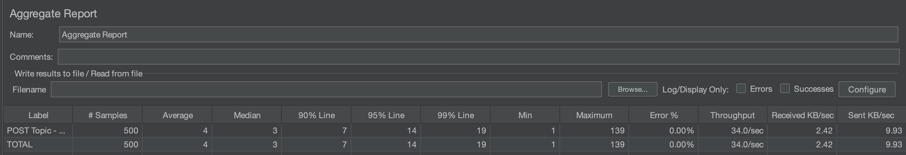

## Built With

* [Spring Boot](https://spring.io/projects/spring-boot) - Spring Boot 2
* [Maven](https://maven.apache.org/) - Dependency Management
* [Docker](https://www.docker.com/) - For containerization of application
* [PostgreSQL](https://www.postgresql.org/) - Database
* [Mockito](https://site.mockito.org/) - Mockito Testing Framework

## Contributing

If you have any improvement suggestions please create a pull request and I'll review it.


## Authors

* **Ankit Rajput** - *Initial work* - [Github](https://github.com/ankitrajput0096)

## License

This project is licensed under the MIT License

## Acknowledgments

* Big thanks to Pivotal for Spring Boot framework, love it!
